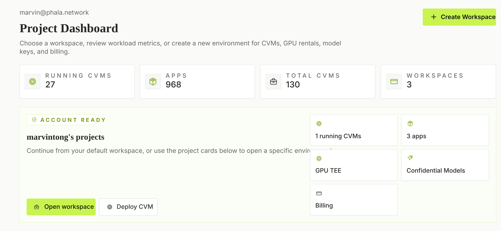

# Phala Cloud

**Deploy Docker workloads to Confidential VMs from the command line.**

[Cloud](https://cloud.phala.com) · [Docs](https://docs.phala.com) · [Trust Center](https://trust.phala.com) · [Templates](https://cloud.phala.com/templates)

[](https://cloud.phala.com/templates)

Phala Cloud lets you run existing containers inside hardware-backed Trusted
Execution Environments. Bring a `docker-compose.yml`, deploy it as a
Confidential VM, seal secrets to the measured build, and fetch attestation proof
for what is running.

- [x] Deploy Docker Compose services as Confidential VMs with the `phala` CLI
- [x] Seal environment variables to the measured build instead of shipping raw secrets
- [x] Stream logs, SSH, copy files, and manage linked CVMs from the terminal
- [x] Fetch attestation proof for deployed workloads
- [x] Start from templates for agents, MCP servers, GPU inference, and apps

The main developer surface in this repository is the `phala` CLI.

## Install the CLI

```bash
npm install -g phala
```

Or run it without installing:

```bash
npx phala <command>
bunx phala <command>
```

Authenticate with Phala Cloud:

```bash
phala login
```

Headless environment:

```bash
phala login --no-open
phala login phak_xxx
```

## Deploy a Confidential VM

From a project that has a `docker-compose.yml`:

```bash
phala deploy -n my-app -c docker-compose.yml -e .env --wait
```

The CLI creates or updates a CVM, seals environment variables when you pass
`-e`, schedules the workload on TDX infrastructure, and waits until the CVM is
ready when `--wait` is set.

After the first deploy, link the directory to the CVM:

```bash
phala link
git add phala.toml
```

`phala.toml` contains no secrets. Once it exists, day-to-day commands can target
the linked CVM automatically:

```bash
phala deploy          # update the linked CVM
phala ps              # list containers
phala logs -f         # stream app logs
phala ssh             # open a shell
phala cp ./file :~/   # copy to the linked CVM
```

## Verify What Ran

Fetch the CVM attestation:

```bash
phala cvms attestation
phala cvms attestation --json > attestation.json
```

The attestation binds the running CVM to its measured runtime and compose hash,
so users and auditors can verify that the deployed workload is the workload that
was registered.

For confidential agents, mount the dstack socket inside the container to use KMS,
Sign-RPC, and attestation from the workload:

```yaml
services:
  agent:
    image: ghcr.io/your-org/agent:latest
    environment:
      - OPENAI_API_KEY=${OPENAI_API_KEY}
    volumes:
      - /var/run/dstack.sock:/var/run/dstack.sock
    ports:
      - "8080:8080"
```

Deploy with sealed credentials:

```bash
phala deploy -n my-agent -c docker-compose.yml -e .env --wait
```

## Common CLI Commands

| Command | Purpose |
| --- | --- |
| `phala deploy` | Deploy a new CVM or update the linked CVM |
| `phala link` | Bind the current directory to a CVM with `phala.toml` |
| `phala apps` | List deployed applications |
| `phala cvms` | Manage CVMs: get, start, stop, restart, resize, delete, attest |
| `phala logs` | Read container, serial, or CVM stderr logs |
| `phala ps` | List containers in a CVM |
| `phala ssh` | SSH into a CVM |
| `phala cp` | Copy files to or from a CVM |
| `phala instance-types` | List available CPU/GPU TEE instance types |
| `phala nodes` | List available TEE worker nodes |
| `phala profiles` | Manage multiple Phala Cloud workspaces |

Full command docs live in [`cli/docs`](./cli/docs).

## What Is in This Repository

| Path | Purpose |
| --- | --- |
| [`cli`](./cli) | Official Phala Cloud CLI, published as `phala` on npm |
| [`js`](./js) | TypeScript SDK, published as `@phala/cloud` |
| [`python`](./python) | Python SDK, published as `phala-cloud` |
| [`go`](./go) | Go SDK for Phala Cloud API automation |
| [`templates`](./templates) | Curated prebuilt templates for MCP servers, agents, model serving, apps, and infrastructure |
| [`skills`](./skills) | Agent-readable workflows for Claude Code, Codex, Cursor, and other coding agents |
| [`terraform`](./terraform) | Terraform provider submodule |

## SDKs

Use the CLI for deployment workflows. Use the SDKs when you need to integrate
Phala Cloud into another product, service, or automation system.

TypeScript:

```bash
npm install @phala/cloud
```

```ts
import { createClient } from '@phala/cloud'

const client = createClient({
  apiKey: process.env.PHALA_CLOUD_API_KEY,
})

const me = await client.getCurrentUser()
```

Python:

```bash
pip install phala-cloud
```

```python
from phala_cloud import create_client

client = create_client(api_key="<api-key>")
me = client.get_current_user()
```

Go:

```bash
go get github.com/Phala-Network/phala-cloud/sdks/go
```

```go
client, err := phala.NewClient(phala.WithAPIKey("<api-key>"))
```

## Templates

The [`templates`](./templates) directory contains prebuilt Phala Cloud
deployments for:

- MCP servers and AI agent tools
- LLM inference and model-serving demos
- AI research and GPU miner workspaces
- Web apps and developer utilities
- Blockchain, oracle, and data workloads
- Confidential computing starter kits

Each prebuilt template includes a `docker-compose.yml` and README. The template
catalog is generated from [`templates/config.json`](./templates/config.json).

Validate template metadata before opening a PR:

```bash
python3 templates/validate.py
```

## Agent Workflows

The [`skills`](./skills) directory turns Phala Cloud workflows into concise
instructions that AI coding agents can follow.

Examples:

- [`skills/phala-cli/SKILL.md`](./skills/phala-cli/SKILL.md) — deploy, update,
  debug, SSH, CI/CD, and attestation with the CLI
- [`skills/usecase/agent-deploy.md`](./skills/usecase/agent-deploy.md) — deploy
  a confidential AI agent with sealed credentials and signed action logs
- [`skills/usecase/gpu-vllm-deploy.md`](./skills/usecase/gpu-vllm-deploy.md) —
  self-host an OpenAI-compatible LLM on GPU TEE
- [`skills/usecase/verify-attestation.md`](./skills/usecase/verify-attestation.md)
  — verify a Phala Cloud TEE attestation end to end

These files are designed to be fetched by coding agents and executed as
step-by-step runbooks.

## Terraform

This repository vendors the Terraform provider as a submodule in
[`terraform`](./terraform).

Clone with submodules:

```bash
git clone --recurse-submodules git@github.com:Phala-Network/phala-cloud.git
```

If you already cloned without submodules:

```bash
git submodule update --init --recursive
```

Terraform Registry:

```hcl
terraform {
  required_providers {
    phala = {
      source  = "phala-network/phala"
      version = "0.2.0-beta.1"
    }
  }
}
```

Provider page: <https://registry.terraform.io/providers/phala-network/phala/latest>

## Development

Install dependencies:

```bash
bun install
```

CLI development:

```bash
cd cli
bun run src/index.ts --help
bun run check
```

SDK checks:

```bash
cd js && bun run check
cd python && make check
cd go && go test ./...
```

## Useful Links

- Phala Cloud: <https://cloud.phala.com>
- Phala Cloud docs: <https://docs.phala.com>
- Trust Center: <https://trust.phala.com>
- API reference: <https://cloud-api.phala.network/docs>
- dstack: <https://github.com/Dstack-TEE/dstack>
- Phala Network: <https://phala.network>

## Responsible Disclosure

Report security vulnerabilities to <cert@phala.com>. See
[SECURITY.md](./SECURITY.md) for scope, reporting requirements, and bounty
ranges.

## Contributing

Issues and pull requests are welcome. For templates, include validation output
and a short smoke-test note. For CLI and SDK changes, include focused tests or a
clear manual verification path.

See [CONTRIBUTING.md](./CONTRIBUTING.md).

## License

This repository is licensed under the MIT License. Some packages and submodules
may carry their own license files.
